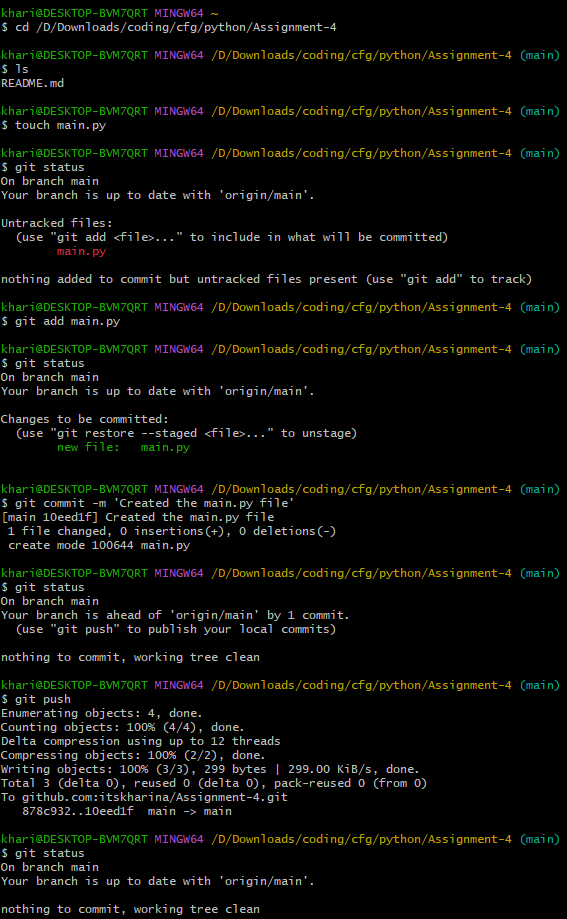
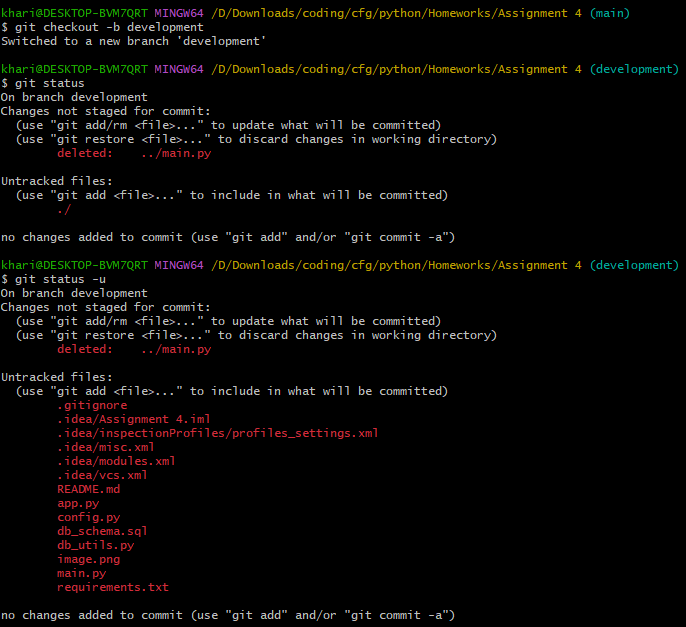
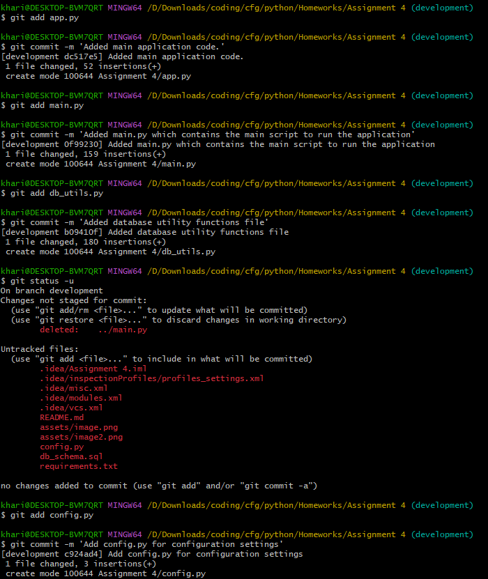
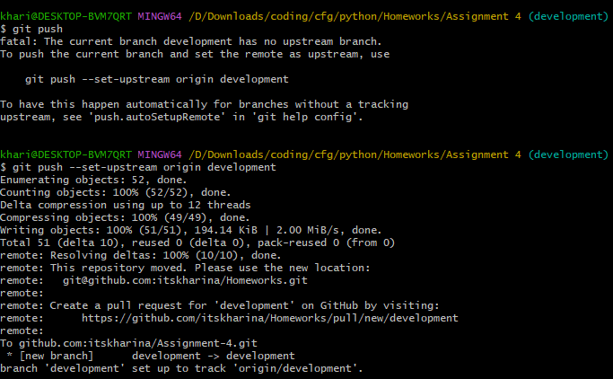
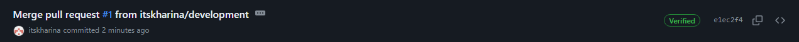

# _Question 1_

- Used `git status` to list all new or modified files that haven't yet been committed.
- Created a new python file using the `touch` command.
- Staged the changes made to the file using `git add <file-name>`.
- Used `git commit -m <message>` to commit my changes to the _local_ repo.
- Used `git push` command to push my changes from the _local_ repo to the _remote_ repo.

(Note that this was before I changed the name of my repo from Assignment 4 to Homeworks)


- Created a new branch for development using the `git checkout -b <branch-name>`. This creates and moves you to the new branch.
- Added modified files to the branch using `git add <file-name>`.
- Used `git commit -m <message>` to commit my changes to the _local_ repo within this new branch.






- **Check my commits/pull request history to see the merging of the development branch**

# _Question 2_

# Pet Adoption API

## Overview

This Pet Adoption API is a simple RESTful API designed to manage pet adoption processes for a pet shop. It allows users to view available pets, adopt a pet, and cancel an adoption. The API is built using Flask, a framework for Python, and interacts with a MySQL database to store and retrieve information about pets and adoptions.

## Features

- **View Available Pets**: Retrieves a list of pets currently available for adoption.
- **View Adoption Information**: Accesses details about past and current adoptions.
- **Adopt a Pet**: Register a new adoption by providing pet details and adopter information.
- **Cancel an Adoption**: Remove an adoption record from the database.

## Getting Started

### Prerequisites

- Python 3.x
- MySQL Server
- Flask
- mysql-connector-python

### Installation

1. **Clone the Repository**

   ```
    git clone https://github.com/itskharina/Homeworks.git
    cd Homeworks/'Assignment 4'
   ```

2. **Install Dependencies**

   ```
   pip install -r requirements.txt
   ```

3. **Configure the Database**

   - Create a MySQL database named `PetAdoption`.
   - Import the `Pets` and `Adoption` tables from the `db_schema.sql` file into your database.

4. **Edit Configuration**

   - Open the `config.py` file and update the `HOST`, `USER`, and `PASSWORD` variables with your MySQL server credentials.

### Running the API

1. **Start the Flask Application**

   ```
   python app.py
   ```
2. **Open a new terminal and run the main script**

   ```
   cd Homeworks/'Assignment 4'
   python main.py
   ```
   
3. **Access the API**

   - The API will be accessible at `http://127.0.0.1:5000/`.
   - You can interact with the API using the Python console.
   - You can also use tools like Postman to interact with the API endpoints.

## API Endpoints

- **GET /availability**: Retrieve a list of available pets.
- **GET /adoption-info**: Retrieve information about past and current adoptions.
- **PUT /adopt**: Adopt a pet by providing pet details and adopter information.
- **DELETE /cancel/{adoption_id}**: Cancel an adoption by providing the adoption ID.

## .gitignore and requirements.txt

- **.gitignore**: This file specifies intentionally untracked files that Git should ignore. It helps to keep the repository clean by excluding files that are not necessary for version control.

- **requirements.txt**: This file lists all Python dependencies required to run the project. It is used by `pip` to install the necessary packages. When someone clones the repository, they can install all dependencies by running `pip install -r requirements.txt`.
